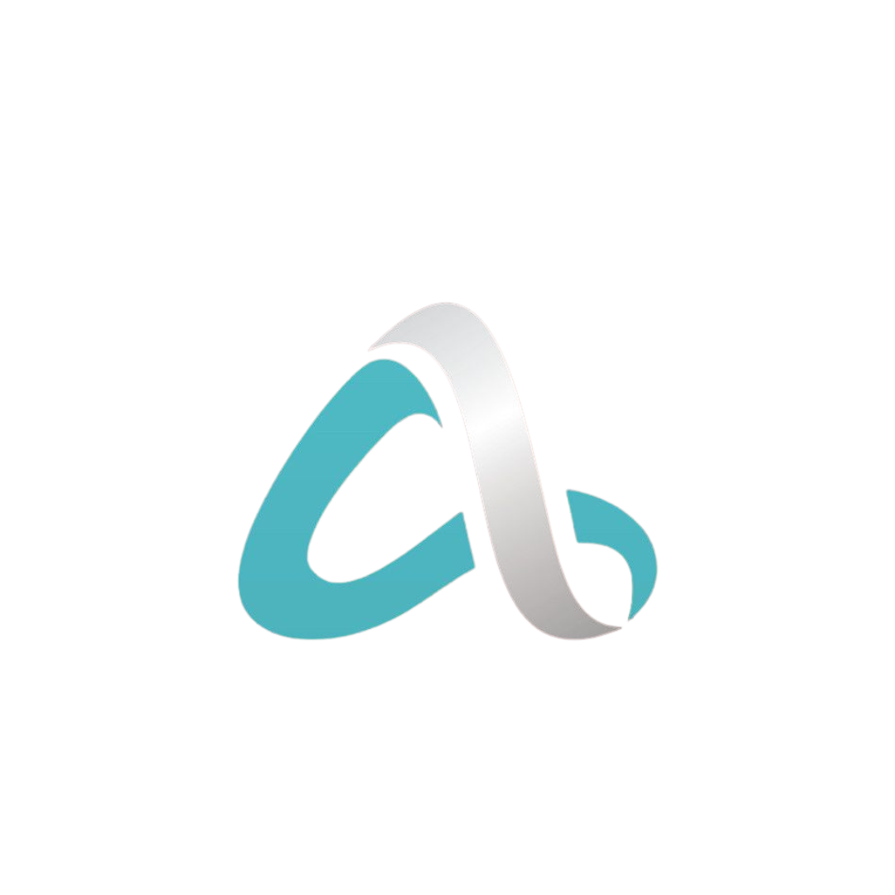
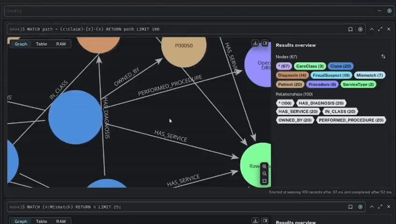
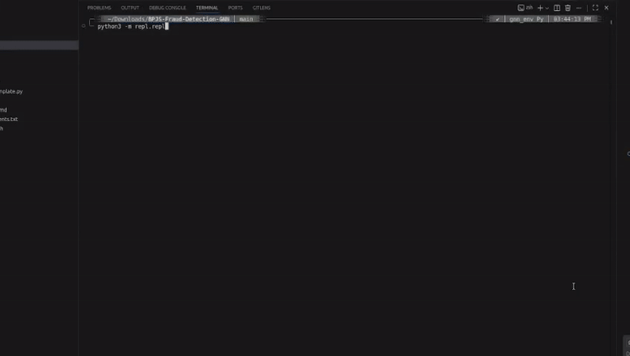

<table style="border: none; margin: 0 auto; padding: 0; border-collapse: collapse;">
<tr>
<td align="center" style="vertical-align: middle; padding: 10px; border: none; width: 250px;">
  
</td>
<td align="left" style="vertical-align: middle; padding: 10px 0 10px 30px; border: none;">
  <pre style="font-family: 'Courier New', monospace; font-size: 16px; color: #0EA5E9; margin: 0; padding: 0; text-shadow: 0 0 10px #0EA5E9, 0 0 20px rgba(14,165,233,0.5); line-height: 1.2; transform: skew(-1deg, 0deg); display: block;">

░█████╗░██╗░░██╗███╗░░██╗░█████╗░███████╗
██╔══██╗██║░░██║████╗░██║██╔══██╗██╔════╝
███████║███████║██╔██╗██║███████║█████╗░░
██╔══██║██╔══██║██║╚████║██╔══██║██╔══╝░░
██║░░██║██║░░██║██║░╚███║██║░░██║██║░░░░░
╚═╝░░╚═╝╚═╝░░╚═╝╚═╝░░╚══╝╚═╝░░╚═╝╚═╝░░░░░
  </pre>
</td>
</tr>
</table>

  

  
  
  
   
  
  
  
  
  
  

## 🌐 Socials:
   

<table width="100%">
  <tr>
    <td width="50%" align="center" valign="top">
      <h3> Neo4j Graph </h3>
      
    </td>
    <td width="50%" align="center" valign="top">
      <h3> Command-Line Pipeline Orchestrator </h3>
      
    </td>
  </tr>
</table>

  <h3>📊 GitHub Stats</h3>
  
  
   
  

## 🏆 GitHub Trophies

### 🔝 Top Contributed Repo

---

 

  <picture>
    <source media="(prefers-color-scheme: dark)" srcset="https://raw.githubusercontent.com/ahnafyura/ahnafyura/output/github-contribution-grid-snake-dark.svg">
    <source media="(prefers-color-scheme: light)" srcset="https://raw.githubusercontent.com/ahnafyura/ahnafyura/output/github-contribution-grid-snake.svg">
    
  </picture>

  <h3>Activity Overview</h3>
  

